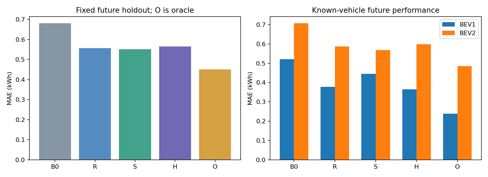
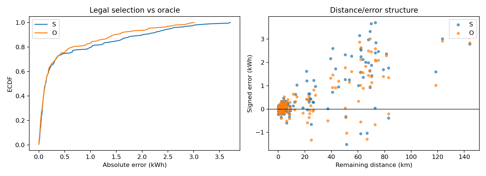

# EV-B01：合法状态与历史的信息价值

完成云端EV-B01：1272条、两辆BEV，固定四次拟合。验证选择S，合法信息投入门槛通过。未来MAE为0.551kWh，Oracle为0.451kWh。仅两车，标签为计数器+IV近似；未来结果不改变验证选模。E5搁置，未启动。

## 做了什么

本轮独立于eVED/V4：首个可信包温桶结束时预测剩余电池净量；同一1272源ID、同一划分，全部小/负标签保留，不重筛质量。四组HistGradientBoosting预测B0残差，固定L1、500轮、无随机内部验证、CPU4线程；四次拟合，不调参、不重训train+val。空间几何50m重采样，未接道路/高程地图。完整冻结协议与输入哈希见同目录。

### 实际划分与覆盖

|集合|记录|BEV1/BEV2|截点范围|≥10km|历史可用|超训练合法数值范围|
|---|---:|---|---|---:|---:|---:|
|calibration|125|{'BEV1': 66, 'BEV2': 59}|2025-01-24 07:16:26+00:00 至 2025-02-15 22:37:47+00:00|52|100.0%|7|
|future|193|{'BEV2': 166, 'BEV1': 27}|2025-02-16 09:03:13+00:00 至 2025-05-27 06:21:34+00:00|62|100.0%|4|
|train|766|{'BEV2': 584, 'BEV1': 182}|2024-05-16 16:04:44+00:00 至 2024-11-30 17:29:58+00:00|295|99.7%|0|
|validation|188|{'BEV1': 94, 'BEV2': 94}|2024-12-01 08:34:19+00:00 至 2025-01-23 20:59:38+00:00|72|100.0%|1|

日期整块，边界及隔离ID见preflight_checks/split_manifest；校准集未拟合、选模或打分。历史只使用已完成、合格、同车训练ID，至多最近10条；同OD亦限制在这10条中。停车/充电历史温度是另一权限，取source开始前已结束桶，不读取它们的终局能量。预处理词表只fit训练，保留unknown、native NaN。

### 标签/边界预检

所有1272条净量守恒误差≤1e-8kWh；逐条复算IV前缀与剩余预算距离；源CSV/ZIP一一关联。状态桶结束≤截点，历史能量end+1秒≤截点，来源及质量池全部落盘。实际未来、当前标签/IV、文件终点和质量覆盖未进入R/S/H。空间几何函数不接收时间，重复静止采样不改变空间特征。

特别注意：仅0/1272条原前缀在截点已完全可得。其余R05梯形前缀可使用截点桶，该桶到cut+1秒才结束。按合同未改标签，前缀从未进入模型；回加后的整程输出只是事后账目，不声称严格cut时可部署。预算距离保留跨截点GPS连线的完整长度，0条含跨界连线、最大0.0000km。无可靠ON/OFF或导航快照。

### 验证选模（先落盘，再查看未来错误）

|组别|MAE kWh|RMSE kWh|偏差 kWh|MAPE % (覆盖)|平均低估 kWh|
|---|---:|---:|---:|---:|---:|
|B0|0.4519|1.0513|-0.1851|20.74 (181/188)|0.3185|
|R|0.4445|0.9205|-0.2976|19.82 (181/188)|0.3711|
|S|0.3548|0.8778|-0.1049|15.96 (181/188)|0.2299|
|H|0.3893|0.9349|-0.1830|17.06 (181/188)|0.2861|
|O（未来Oracle）|0.3641|0.8705|-0.2078|17.43 (181/188)|0.2860|

基础参考=R，合法候选=S，业务合法选择=S；≤1%差选简单者，O不参与。工程投入门槛通过：

|条件|通过|候选/参考或说明|
|---|---|---|
|mae_at_least10pct|True|0.7981703004897226|
|rmse_not_worse5pct|True|0.953591015105937|
|underestimate_not_worse5pct|True|0.6194326142873989|
|vehicle_BEV1|True|0.7883687952879598|
|vehicle_BEV2|True|0.8163409863293674|
|ge10km|True|0.8531717094775182|

详见validation_decision.json及validation_lock.json。未来留出不重选、不移动日期、不反向调参。

## 学到了什么

### 固定未来留出

|组别|MAE kWh|RMSE kWh|偏差 kWh|MAPE % (覆盖)|平均低估 kWh|
|---|---:|---:|---:|---:|---:|
|B0|0.6803|1.2006|+0.4467|27.59 (186/193)|0.1168|
|R|0.5575|1.0196|+0.3697|22.59 (186/193)|0.0939|
|S|0.5513|1.0198|+0.4388|21.33 (186/193)|0.0562|
|H|0.5653|1.0580|+0.4491|22.62 (186/193)|0.0581|
|O（未来Oracle）|0.4510|0.8297|+0.3265|19.47 (186/193)|0.0622|

剩余与回加整程的MAE/RMSE/偏差相同；完整量MAPE另见metrics.json，阈值真值>0.1kWh，覆盖同时保存。WAPE、车辆宏平均MAE、低估95分位、所有预定义切片及敏感性指标均见JSON。未来各组全覆盖，质量子集不重训。

### 配对变化与不确定性

|左→右|右侧MAE改善kWh|95%周块区间|周块/记录|
|---|---:|---|---|
|R→S|+0.0062|-0.0241 至 +0.0318|14/193|
|S→H|-0.0140|-0.0438 至 +0.0175|14/193|
|H→O|+0.1143|+0.0627 至 +0.1818|14/193|
|S→O|+0.1003|+0.0520 至 +0.1706|14/193|
|B0→R|+0.1228|+0.0869 至 +0.1602|14/193|
|B0→S|+0.1290|+0.0798 至 +0.1721|14/193|
|B0→H|+0.1150|+0.0803 至 +0.1462|14/193|
|B0→O|+0.2293|+0.1706 至 +0.3124|14/193|

正值表示右侧MAE更低。1000次同日历ISO周整块重采样，两车同周一起，seed42；只刻画两车的时间样本不确定性，不是车队泛化置信区间。区间跨0不等于证明信息无用。

### 分层、训练与反证

|组|训练MAE|验证MAE|未来MAE|≥10km未来MAE|新OD未来MAE|
|---|---:|---:|---:|---:|---:|
|B0|0.4592|0.4519|0.6803|1.7776|0.9442|
|R|0.1863|0.4445|0.5575|1.4789|0.7795|
|S|0.1578|0.3548|0.5513|1.4856|0.7919|
|H|0.1569|0.3893|0.5653|1.5267|0.8087|
|O|0.1213|0.3641|0.4510|1.1752|0.6332|

|预定义未来质量子集|n|合法选择MAE|Oracle MAE|
|---|---:|---:|---:|
|no_uncertain_charger|185|0.5471|0.4473|
|internal_consistency|189|0.5622|0.4563|
|no_gt2s_gap|185|0.5646|0.4569|
|quantization_le5pct|188|0.5633|0.4610|

切片阈值在拟合前固定，n<20只描述；子集有场景混杂，改善不能归因纯量测质量。新OD是粗空间key而非道路link留出，超训练范围指任一合法数值超训练min/max，不是严格OOD。R05温度表已去重24冲突桶，丢失副本不能恢复；当前source优先值与可辨识冲突独立记录。原始路线位置异常可影响空间转向表示，预算D做了原定义的合理性过滤，几何特征未用未来速度做清洗；因此R弱不能否定完整地图信息。

### H1–H5更新

|假设|本轮更新|支持、反证与缺证|
|---|---|---|
|H1 合法信息/运行缺口|维持存在，按块评价主导性|未来R→S改善+0.0062kWh；S→O改善+0.1003kWh。S混合SOC/外温/包温，不能全归温度；O只诊断有限未来统计，不是理论下界。|
|H2 标签/边界|内部可用性维持，部署边界风险上调|守恒、前缀与距离逐条复算；prefix可用晚1秒新证据。质量切片不是独立真值，无法识别绝对校准误差。|
|H3 异构供能/分量语义|BEV混杂下调，组件辨识不变|本轮两BEV，无燃油混合；counter+IV净量仍非认证traction/HVAC。与旧PHEV分数不能比较提升。|
|H4 任务时点/评价错位|任务目标更对齐，严格截点限制保留|本轮整程净电预算、低估风险与绝对误差统一；剩余预测合法，回加前缀精确实时性未认证，非严格出发前任务。|
|H5 车辆/路线/时间覆盖|维持高|同日期未来留出、新OD/距离/温度切片；只有两已知车，历史冻结存在陈旧性，不能扩展到陌生车。|

## 因此做什么

下一主线：优先完善同条件路线预算与独立区间校准，检查车辆/长程低估，再分边界验证第二公开源；不先扩网络。合法信息通过验证护栏且未来点改善保持，但仍须查看配对区间与小切片，不能直接宣称普适。

先修正前缀的实时可用边界，再做下一轮实时预算协议：从已结束桶计算causal prefix，重定义相应remaining并记录差异，或明确推迟输出时点；不能悄悄替换本轮冻结标签。本轮未来错误已经查看，若据此改方案，该集合随后称开发基准，不能再称全新最终测试。E5保持搁置，本轮不自动启动任何后续实验。

计算：Linux-5.15.0-78-generic-x86_64-with-glibc2.35，sklearn 1.9.1，numpy 2.3.2，pandas 3.0.5，4线程。各组耗时见runtime.json，四fit合计8.98秒。参数与缺失/预处理合同见JSON；模型含训练词表、B0率、特征顺序与配置，支持复算。

实现依据：[HistGradientBoostingRegressor官方API](https://scikit-learn.org/stable/modules/generated/sklearn.ensemble.HistGradientBoostingRegressor.html)。运行云端实际版本，不升级已有环境。
