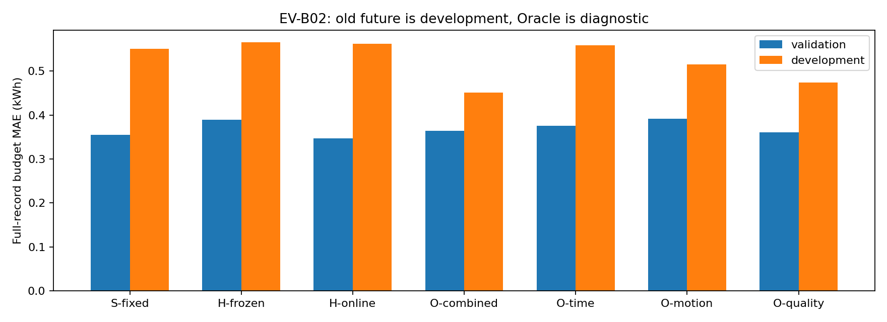
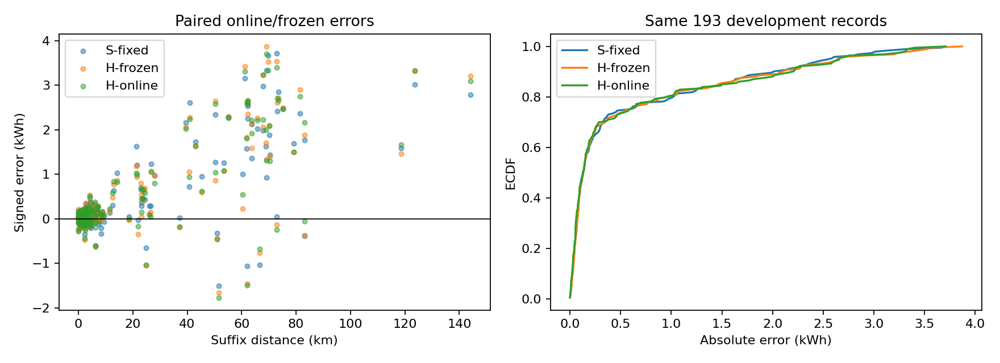

# EV-B02：历史新鲜度与运行信息分解实验

EV-B02已在原云端完成：同1272 ID，不换标签/划分，125条校准终局量未用。相同H权重仅刷新已完成历史，验证/开发MAE=0.3473/0.5618kWh，完整投入门槛未通过。另固定三次拟合拆耗时/运动/采样Oracle。旧future只作开发参考，E5及新队列未启动。

## 1. 目的与预设假设

检验两点：（1）原H无稳定增益，是历史失鲜还是相同映射无法利用近期信息？（2）实际耗时、运动或采样覆盖，哪块更有诊断价值？假设、工程门槛、最大三fit在运行前冻结于protocol_frozen.md/run_config.json，不据结果补拟合。

## 2. 操作、任务与因果合同

本轮不是eVED/V3新增分数，而是EnergyVille两已知BEV记录净电预算。保留EV-B01全部1272 ID：train766（182/584）、validation188（94/94）、calibration125（66/59）、开发参考193（27/166）。开发参考是已查看的旧future，不是新独立测试；无晚于旧future的新记录可用于确认性检验。只两车，不作陌生车辆或车队结论。

输入截止仍为t_cut，预算输出明确推迟至t_cut+1秒；原最新前缀桶此时已结束，1272条全部通过可得时点检查。原y_rem/e_prefix/y_full/D不改，y_full=e_prefix+y_rem。suffix仍从旧cut起算，不称新预算时点后的remaining；预测suffix后加已可得前缀成为整记录预算，剩余与整记录误差相同，但WAPE/MAPE分母不同。该任务不是严格出发前预测，没有独立ON/OFF或导航快照；路线是记录后重建的空间代理。

### 阶段A：零fit、同一保存H权重

S-fixed/H-frozen/O-combined重放原模型及原输入。H-online只刷新25个非thermal历史能量/使用特征；6个past_thermal、当前S、几何、缺失策略、最新10条限制、10条内同OD、词表、B0率及权重保持不变。训练仍仅已完成train；validation允许已完成train及更早validation；开发允许已完成train、validation及更早开发记录。125 calibration从不查询、释放或读其终局能量/源统计。在线开发场景允许先前完成记录的真值成为后续部署观测，与静态不看任何留出标签的实验不同，须分别解释。

事件reader只在完整source结束+1秒≤查询cut时释放同车质量合格记录，共1053次。目标描述用完整source净量/距离/均温/耗时，不混suffix距离。manifest逐项保存ID、许可、桶结束时点、特征来源和快照hash。训练历史公式复算最大差5.68e-14，然后使用原保存训练CSV精确值作浮点规范化，避免极小舍入跨树阈值。对一个未结束长记录终局量增加1000kWh，所有更早查询特征和同H预测完全不变；见causal_audit.json。S/H/O控制重放≤1e-8kWh，见control_replay_checks.json。

### 阶段B：恰好三次固定fit

|组|原冻结H追加量|意义与限制|
|---|---|---|
|O-time|真实suffix耗时|时间相关运行/负载代理，不认证HVAC|
|O-motion|真实距离加权v²、观测停车比例及二者missing|运动结构；missing仍可能是量测代理|
|O-quality|运动覆盖、motion_missing|采样/表示质量代理，不视为交通|

三组训练都用原训练期冻结历史，非H-online；目标B0残差、native NaN、训练词表和ID不变。固定HistGradientBoosting absolute_error、lr0.05、500轮、31叶、minleaf20、l2=1、无内部早停、seed42、CPU4线程。不使用cal，不网格、不多seed、不train+val重训；原H/S/O没有重训。全部实际未来量仅Oracle，不进入H-online，不使用未来IV/终点SOC/能量作为特征，不是可部署模型或理论下界。

## 3. 结果：完整记录预算

### 验证188条

|组|MAE kWh|RMSE kWh|bias kWh|WAPE %|车辆宏MAE|平均低估|低估p95|MAPE % / 有效数|
|---|---:|---:|---:|---:|---:|---:|---:|---|
|S-fixed|0.3548|0.8778|-0.1049|10.07|0.3548|0.2299|0.9499|17.01 / 183/188|
|H-frozen|0.3893|0.9349|-0.1830|11.05|0.3893|0.2861|1.0374|18.48 / 183/188|
|H-online|0.3473|0.8605|-0.1223|9.86|0.3473|0.2348|0.7343|17.15 / 183/188|
|O-combined|0.3641|0.8705|-0.2078|10.34|0.3641|0.2860|1.0689|18.91 / 183/188|
|O-time|0.3757|0.9403|-0.1823|10.66|0.3757|0.2790|1.0414|16.46 / 183/188|
|O-motion|0.3915|0.9347|-0.2123|11.11|0.3915|0.3019|1.0040|19.58 / 183/188|
|O-quality|0.3605|0.8412|-0.1813|10.23|0.3605|0.2709|1.0126|18.84 / 183/188|

MAPE仅真值>0.1kWh；其余小/负量仍完整进入MAE/RMSE等主指标。正bias为高估，不裁预测。逐行/分层指标见predictions与metrics.json。

### 开发参考193条

|组|MAE kWh|RMSE kWh|bias kWh|WAPE %|车辆宏MAE|平均低估|低估p95|MAPE % / 有效数|
|---|---:|---:|---:|---:|---:|---:|---:|---|
|S-fixed|0.5513|1.0198|+0.4388|16.19|0.5068|0.0562|0.2174|21.18 / 186/193|
|H-frozen|0.5653|1.0580|+0.4491|16.60|0.4814|0.0581|0.2327|22.52 / 186/193|
|H-online|0.5618|1.0551|+0.4429|16.49|0.4956|0.0594|0.2092|21.16 / 186/193|
|O-combined|0.4510|0.8297|+0.3265|13.24|0.3621|0.0622|0.3753|19.33 / 186/193|
|O-time|0.5593|1.0511|+0.4459|16.42|0.4816|0.0567|0.2200|20.60 / 186/193|
|O-motion|0.5154|0.9663|+0.3976|15.13|0.4186|0.0589|0.2626|20.10 / 186/193|
|O-quality|0.4739|0.8681|+0.3480|13.91|0.3938|0.0629|0.3326|21.18 / 186/193|

MAPE仅真值>0.1kWh；其余小/负量仍完整进入MAE/RMSE等主指标。正bias为高估，不裁预测。逐行/分层指标见predictions与metrics.json。

### 每车与距离反证

|分区/车型/距离|n|S MAE|冻结H MAE|在线H MAE|在线H bias|
|---|---:|---:|---:|---:|---:|
|validation/BEV1|94|0.4553|0.5242|0.4350|-0.3243|
|validation/BEV2|94|0.2543|0.2543|0.2596|+0.0798|
|validation/10-50|53|0.4604|0.5215|0.4345|-0.0637|
|validation/2-10|82|0.1447|0.1465|0.1425|-0.0244|
|validation/<2|34|0.1049|0.1110|0.1071|+0.0212|
|validation/>=50|19|1.4146|1.5663|1.4180|-0.9646|
|development/BEV1|27|0.4450|0.3648|0.4036|+0.3602|
|development/BEV2|166|0.5685|0.5979|0.5875|+0.4563|
|development/10-50|25|0.7812|0.7615|0.7327|+0.6219|
|development/2-10|80|0.1313|0.1272|0.1225|+0.0240|
|development/<2|51|0.0742|0.0837|0.0753|+0.0180|
|development/>=50|37|1.9615|2.0437|2.0666|+1.8133|

原划分BEV1开发只有27条、≥50km仅3条，低样本层只能描述。质量/粗OD/年龄/车/外温完整结果见metrics.json。不能用总体改善遮盖某车退化。

### 阶段A门槛

|分区|条件|通过|比值或原因|
|---|---|---|---|
|validation|vs_H_improve10pct|True|0.8921289987033911|
|validation|vs_S_improve5pct|False|0.978793632945538|
|validation|vs_S_rmse_guard|True|0.9803714227857995|
|validation|vs_S_under_guard|True|1.0214302449858317|
|validation|vehicle_BEV1|True|0.9552786234315922|
|validation|vehicle_BEV2|True|1.0208935778967476|
|validation|ge10km|True|0.9744486803974478|
|development|vs_H_improve10pct|False|0.9937869743882242|
|development|vs_S_improve5pct|False|1.0190767890118622|
|development|vs_S_rmse_guard|True|1.0346079661434504|
|development|vs_S_under_guard|False|1.0576417965228426|
|development|vehicle_BEV1|True|0.9071230588002124|
|development|vehicle_BEV2|True|1.0333282281940421|
|development|ge10km|True|1.0290673658914826|

完整门槛未通过。门槛是研究投入依据，不是业务验收；护栏失败与MAE改善并列报告，负结果不否定其他能利用新鲜输入的映射。

### Oracle单块效果、集中度与护栏

|组/分区|相对H MAE改善|前5%正收益占比|低覆盖正收益占比|高覆盖子集改善kWh|
|---|---:|---:|---:|---:|
|O-time/validation|3.5%|25.9%|4.0%|+0.0140|
|O-motion/validation|-0.6%|38.9%|6.9%|-0.0046|
|O-quality/validation|7.4%|41.9%|13.0%|+0.0233|
|O-time/development|1.1%|34.0%|2.2%|+0.0060|
|O-motion/development|8.8%|33.7%|2.1%|+0.0543|
|O-quality/development|16.2%|34.1%|4.4%|+0.0977|

- O-time完整双分区10%+非集中门槛：False。

- O-motion完整双分区10%+非集中门槛：False。

- O-quality完整双分区10%+非集中门槛：False。

集中度以最大ceil(5%n)条正收益占所有正收益衡量，50%屏幕阈值在fit前冻结；覆盖≥0.95。正收益统计不掩盖负收益（gain_concentration.csv保存二者）。这是描述性筛查，不是因果证明；三个单块与组合O之间仍可能有交互和树表示差异。

### 开发参考周块配对

|左→右|MAE改善kWh|95%周块区间|周数|
|---|---:|---|---:|
|H-frozen→H-online|+0.0035|[-0.0120, +0.0165]|14|
|S-fixed→H-online|-0.0105|[-0.0399, +0.0189]|14|
|H-frozen→O-combined|+0.1143|[+0.0627, +0.1818]|14|
|S-fixed→O-combined|+0.1003|[+0.0520, +0.1706]|14|
|H-frozen→O-time|+0.0060|[-0.0048, +0.0183]|14|
|S-fixed→O-time|-0.0080|[-0.0375, +0.0247]|14|
|O-time→O-combined|+0.1083|[+0.0616, +0.1768]|14|
|H-frozen→O-motion|+0.0499|[+0.0095, +0.1001]|14|
|S-fixed→O-motion|+0.0359|[-0.0021, +0.0916]|14|
|O-motion→O-combined|+0.0644|[+0.0281, +0.1106]|14|
|H-frozen→O-quality|+0.0914|[+0.0463, +0.1470]|14|
|S-fixed→O-quality|+0.0774|[+0.0348, +0.1327]|14|
|O-quality→O-combined|+0.0229|[+0.0058, +0.0497]|14|

1000次seed42，同ISO周两车一起重采样已固定在线策略误差；不打乱历史重建特征。不是车队泛化区间，也不是严格在线依赖下的覆盖保证，旧开发集非确认性证据。

## 4. 描述诊断与未区分原因

### 新鲜历史与重复路线支持

开发193条全有可用历史，中位3.637小时，190条≤7天，对照冻结约104.9天。及时性提高不等于预算精度必然提高。当前H依然只在最近10条内搜索粗OD。

|分区|n|90天同粗OD≥1/3/5|至少一条空间支持|
|---|---:|---|---:|
|train|766|252/134/84|191|
|validation|188|67/25/14|56|
|development|193|47/19/8|34|

诊断检索全部已完成、合格、同车且90天内同OD历史，不限10条；没有把这个新摘要送入H。用未按未来速度清洗的整条空间路径，50m重采样，双向最近距离均值≤50m/p95≤100m、长度比0.8–1.25作描述性支持。粗OD相同仍不保证同道路；几何异常会影响空间检索。路径误差/年龄/距离逐对见route_history_pairs.csv，不是道路link导航真值。

### 联合条件、共同支持与组成敏感性

车辆×四距离×四外温共32格，三个分区每格列n、suffix/full-source汇总Wh/km、MAE、bias和组合Oracle相对H收益，见conditional_support.csv。n<10只描述，无支持格不能做条件内比较。sum(y_rem)/sum(D)是同suffix量；full-source列另配完整源距离，不混边界。

|共同格每区最少n|格数|开发覆盖/未覆盖|S验证共同格MAE→开发组成重加权|开发共同格S MAE|
|---|---:|---|---|---:|
|1|15|191/193，未覆盖1.0%|0.3492→0.2221|0.5565|
|10|3|60/193，未覆盖68.9%|0.1831→0.2114|0.4962|

重加权只是验证误差对开发格频率的描述，未改任何预测，不等于季节/温度/坡度因果；不能跨缺格归因。年龄与原同OD分层在metrics.json中全部按同一组样本配对。

### 几何/采样质量

validation/开发geometry比冻结预算D大>1%分别39/10条；未删源、未重算模型。列车、距离、温度、内部一致性、gap、误差与纯空间≥250/1000m弦长计数，见geometry_diagnostics.csv。弦长只提供位置跳跃线索，没有地图证据时不认证GPS错误。禁止用实际未来速度清洗合法模型特征。预算D自身沿用原标签版本的合理性过滤，路线几何未过滤，两者定义差异可成为表示误差。

## 5. 解释：H1–H5的支持、反证与缺证

|假设|本轮证据更新|不能推出什么/还缺什么|
|---|---|---|
|H1 合法信息/历史失鲜|在线H验证/开发相对冻结H改善10.8%/0.6%；及时观测已实现，门槛False。单块Oracle显示映射对不同代理的敏感性|固定H反事实不等于最优在线模型；未来统计不是合法输入，也不等同交通/HVAC真实因果|
|H2 标签/边界|保持原净量与全部ID；1秒延迟使前缀可得；几何质量逐源审计|未提供独立电表真值，不能用某Oracle精度或几何异常证明label错误|
|H3 分量/供能语义|仍两BEV净电预算，无油电混合；未重新构造组件label|耗时收益不认证HVAC，不能把电池净量拆成准确纯牵引与附件|
|H4 时点/评价|输出合同更清楚；MAE、偏差、低估及MAPE覆盖共同评估|延迟预算不等于严格出发前；小/负量不删，风险指标改善不能由MAE单独保证|
|H5 场景覆盖|历史新鲜度、同路线支持、32条件格、开发再加权与长程偏差可直接定位|仅两已知车；共同条件缺格和未测道路/坡度/行为仍混杂；无新独立future|

## 6. 决定：继续什么，暂不做什么

在线H未通过完整投入门槛，不将新鲜度提高宣布为部署成功；继续保留原验证选择S作为合法固定参考。先查看收益车/条件与负收益、共同支持及表示，而非直接扩大网络或推广单一全局历史平均。 三个Oracle单块没有通过全部门槛；报告点改善与集中度，不用某一侧最优值选择网络，也不追加第四fit。 time若只在部分条件有效，合法候选是过去同路线耗时分布而非未来真值；motion若有益且路线支持薄，优先公开道路/限速/坡度；quality若有益，先审采样/几何，不全讲成交通。若点方案仍不稳，再冻结独立条件区间协议，不先画宽区间代替信息辨别。

本轮不启动E5、区间训练、地图拉取、新公开源混库或新网络网格。125 calibration仅元信息引用，未消费终局量。后续确认性评测需另验公开独立源的计量边界/路线与已知车历史，不能将原cal改名新future。

### 计算成本与复核入口

|组|新增fit秒|特征数（含车型one-hot）|开发推理秒|
|---|---:|---:|---:|
|S-fixed|0.000|旧保存模型|0.0180|
|H-frozen|0.000|旧保存模型|0.0164|
|O-combined|0.000|旧保存模型|0.0133|
|H-online|0.000|旧保存模型|0.0130|
|O-time|2.201|72|0.0129|
|O-motion|2.297|75|0.0121|
|O-quality|2.142|73|0.0122|

云端Linux-5.15.0-78-generic-x86_64-with-glibc2.35；Python 3.12.3、sklearn 1.9.1、pandas 3.0.5、numpy 2.3.2，4线程，新增fit总数3，总fit6.64秒。输入、代码、三保存模型与训练ID、runtime和completion哈希均留存，原EV-B01文件哈希再次核对未变。没有本地训练。
